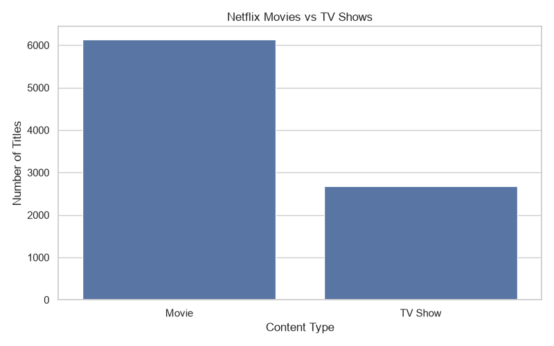
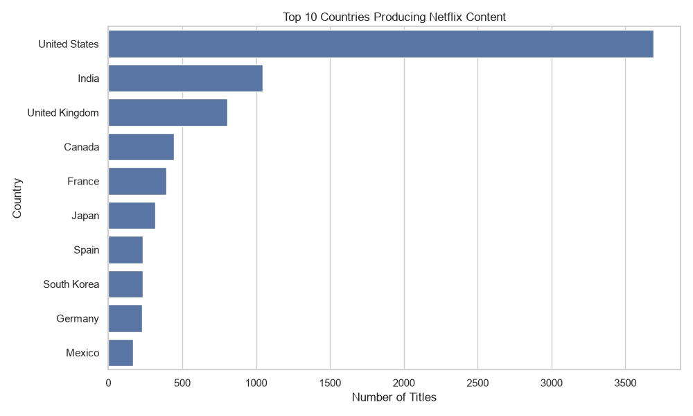
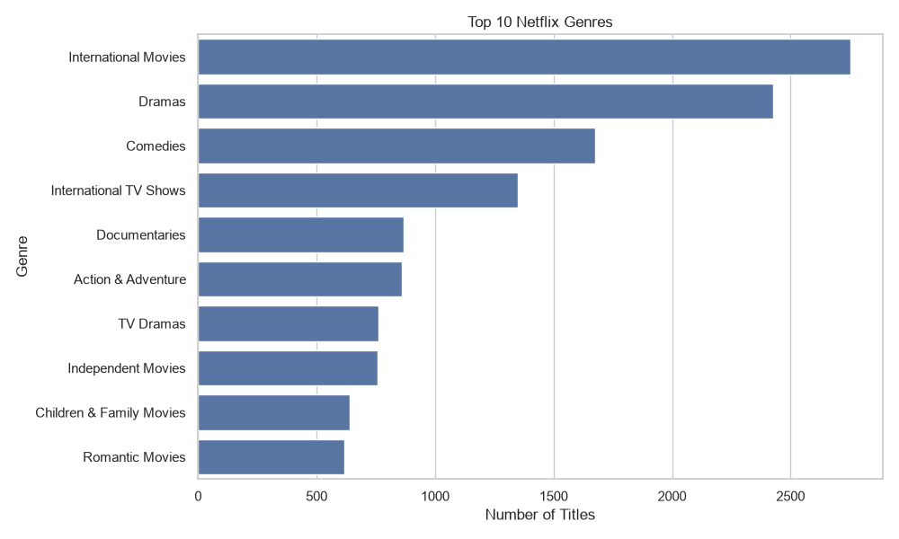
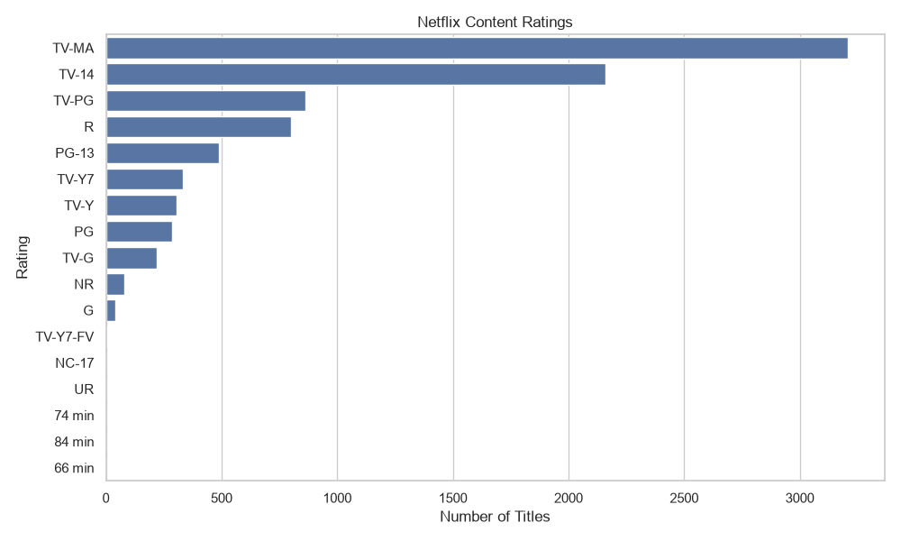
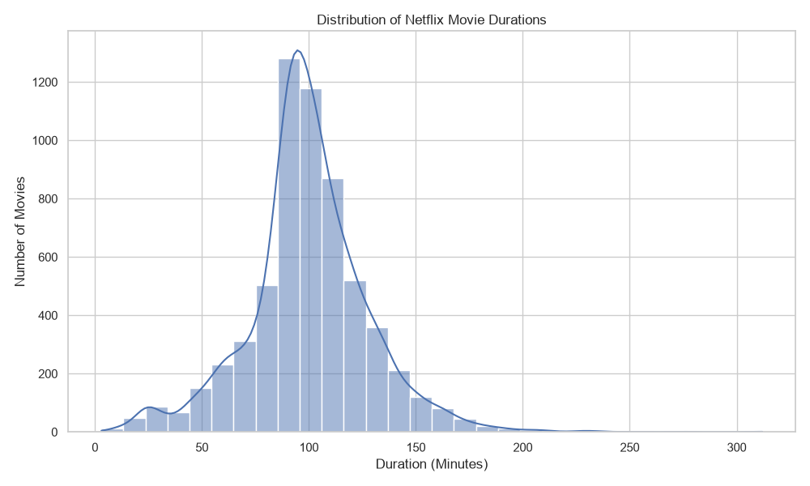
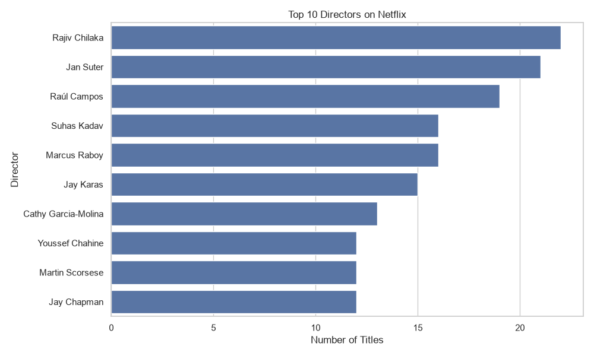
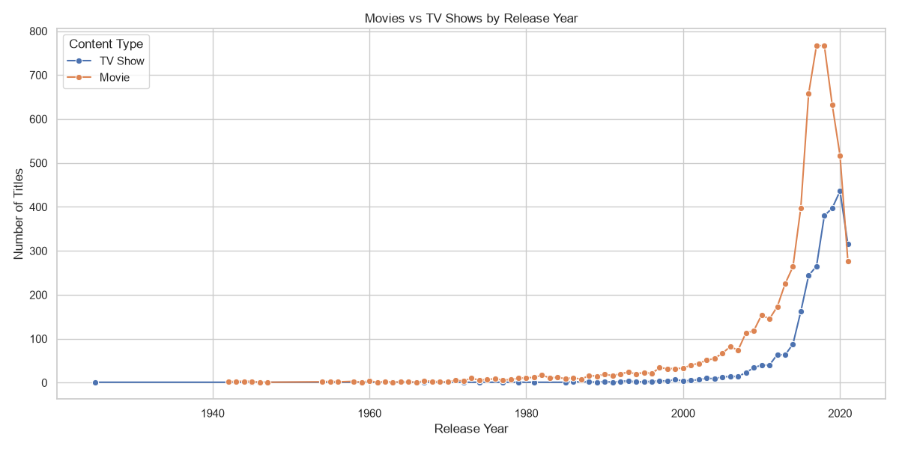

# 🎬 Netflix Data Analyzer

> **Explore Netflix content, discover trends, and uncover insights using Python, Pandas, Matplotlib, and Seaborn.**

[](https://www.python.org/)
[](https://pandas.pydata.org/)
[](https://matplotlib.org/)
[](https://seaborn.pydata.org/)
[](https://github.com/keerthana12-codes)

---

## 📌 Project Overview

**Netflix Data Analyzer** is a Python-based data analysis project that explores the **Netflix Movies and TV Shows dataset**.

The project uses **Pandas** for data manipulation and **Matplotlib & Seaborn** for data visualization to identify patterns, trends, and interesting insights from Netflix's content catalog.

### 🎯 What does this project analyze?

* 🎬 Movies vs TV Shows
* 🌍 Top 10 Countries producing Netflix content
* 🎭 Top 10 Genres
* 📈 Content distribution by Release Year
* ⭐ Netflix Content Ratings
* ⏱️ Movie Duration
* 🎥 Top 10 Directors
* 📊 Movies vs TV Shows by Year
* 📋 Overall Netflix Statistics

---

## ✨ Key Features

| Feature              | Description                          |
| -------------------- | ------------------------------------ |
| 🎬 Content Analysis  | Compare Movies and TV Shows          |
| 🌍 Country Analysis  | Find countries with the most content |
| 🎭 Genre Analysis    | Identify the most common genres      |
| 📈 Year Analysis     | Analyze Netflix content over time    |
| ⭐ Rating Analysis    | Explore content ratings              |
| ⏱️ Duration Analysis | Study typical movie durations        |
| 🎥 Director Analysis | Find directors with the most titles  |
| 📊 Visualization     | Generate informative charts          |
| 📋 Statistics        | Display overall dataset statistics   |

---

## 🛠️ Technologies Used

* 🐍 **Python**
* 🐼 **Pandas**
* 📊 **Matplotlib**
* 🎨 **Seaborn**
* 💻 **VS Code / Jupyter Notebook**
* 🔧 **Git & GitHub**

---

## 📂 Project Structure

```text
netflix-analyzer/
│
├── analyzer.py
├── netflix_titles.csv
├── README.md
├── requirements.txt
├── .gitignore
│
└── charts/
    ├── movies_vs_tv_shows.png
    ├── top_10_countries.png
    ├── top_10_genres.png
    ├── content_by_release_year.png
    ├── netflix_ratings.png
    ├── movie_duration.png
    ├── top_10_directors.png
    └── movies_vs_tv_shows_by_year.png
```

---

## 📊 Data Analysis

### 🎬 Movies vs TV Shows

The project compares the number of Movies and TV Shows available in the Netflix dataset.

### 🌍 Top 10 Countries

Identifies the countries that contribute the highest number of Netflix titles.

### 🎭 Top 10 Genres

Analyzes the most frequently occurring genres in the dataset.

### 📈 Content by Release Year

Shows how Netflix content has changed across different release years.

### ⭐ Netflix Ratings

Examines the distribution of content ratings such as:

* TV-MA
* TV-14
* PG-13
* R
* PG
* G

### ⏱️ Movie Duration

Analyzes movie durations to understand the typical length of Netflix movies.

### 🎥 Top 10 Directors

Identifies directors associated with the largest number of titles.

### 📊 Movies vs TV Shows by Year

Compares the growth and distribution of Movies and TV Shows over time.

---

## 🖼️ Visualizations

### 🎬 Movies vs TV Shows



### 🌍 Top 10 Countries



### 🎭 Top 10 Genres



### 📈 Content by Release Year


### ⭐ Netflix Ratings



### ⏱️ Movie Duration



### 🎥 Top 10 Directors



### 📊 Movies vs TV Shows by Year



---

## 🔍 Key Insights

The analysis provides insights into:

* 🎬 Whether Movies or TV Shows dominate the Netflix catalog
* 🌍 Which countries produce the most Netflix content
* 🎭 Which genres are most common
* 📈 How Netflix content has evolved over the years
* ⭐ Which ratings appear most frequently
* ⏱️ The typical duration of Netflix movies
* 🎥 Which directors have the most titles
* 📊 How Movies and TV Shows have changed over time

---

## 🚀 Getting Started

### Navigate to the Project

```bash
cd netflix-analyzer
```

### Install Dependencies

```bash
pip install -r requirements.txt
```

###  Run the Analyzer

```bash
python analyzer.py
```

---

## 📦 Requirements

The project requires the following Python libraries:

```text
pandas
matplotlib
seaborn
```

You can install them using:

```bash
pip install -r requirements.txt
```

---

## 💻 Example Workflow

```text
Netflix Dataset
      ↓
Data Loading
      ↓
Data Cleaning
      ↓
Data Analysis
      ↓
Statistical Analysis
      ↓
Data Visualization
      ↓
Insights & Findings
```

---

## 📋 Dataset

The project uses the **Netflix Movies and TV Shows dataset**, containing information such as:

* Show ID
* Type
* Title
* Director
* Cast
* Country
* Date Added
* Release Year
* Rating
* Duration
* Listed In
* Description

---

## 🎯 Learning Outcomes

Through this project, I practiced:

* 🐍 Python programming
* 🐼 Pandas data manipulation
* 🧹 Data cleaning
* 📊 Exploratory Data Analysis (EDA)
* 📈 Data visualization
* 🔎 Finding patterns in datasets
* 📋 Generating statistical insights
* 💻 Managing a data analysis project with Git and GitHub

---

## 🚀 Future Improvements

* [ ] 🎨 Build an interactive **Streamlit dashboard**
* [ ] 🔎 Add filtering by country
* [ ] 🎭 Add genre-based filtering
* [ ] 📅 Add year-based filtering
* [ ] 📊 Add interactive **Plotly** visualizations
* [ ] 📈 Add advanced statistical analysis
* [ ] ☁️ Deploy the application online

---

## 👩‍💻 Author

### Keerthana MS

🎓 **Computer Science Engineering Student**

Passionate about **Python, Data Analysis, Machine Learning, and Software Development**.

### 🔗 Connect With Me

* 💻 **GitHub:** https://github.com/keerthana12-codes
* 💼 **LinkedIn:** https://www.linkedin.com/in/keerthana-ms-20b37a303

---

## ⭐ Support

If you found this project useful or interesting, consider giving it a ⭐ on GitHub!

---

### 🎬 Analyze. Visualize. Discover. 🚀

**Netflix Data Analyzer — Turning Netflix data into meaningful insights with Python.**
